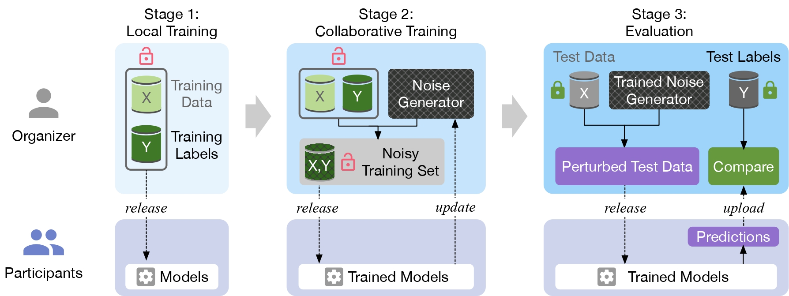

# THEMIS: A Fair Evaluation Platform for Computer Vision Competitions

The rapid advancement of machine learning in academia and industry has sprung numerous online competitions, especially in the computer vision area. However, it has become increasingly thorny for computer vision competitions to preserve fairness when participants intentionally fine-tune their models against the test datasets to improve their performance. Therefore, we propose **Themis** to enhance the fairness of these competitions and alleviate the burden for both the organizer and participants.

## Workflow



We split **Themis**'s workflow into three stages, local training, collaborative training, and evaluation.

- Local Training: The organizer releases the training set, and then participants train their models.
- Collaborative Training: The organizer and participants jointly train a noise generator to protect test data from hand-labeling.
- Evaluation: The organizer releases test data with noise added, and evaluate the results submitted by the participants.

## Setup

The folder structure is below. You should create new folders to ensure that there is no path error when you run the code. We conduct experiments with three datasets, the UTKFace dataset, the CIFAR-10 and CIFAR-100 datasets, so you'd better prepare them before executing.

```txt
├─assets
├─config
├─data
│  ├─cifar
│  ├─cifar100
│  └─UTKFace
│      ├─test
│      └─train
├─models
└─out
    ├─CIFAR10
    │  ├─images
    │  ├─logs
    │  └─models
    ├─CIFAR100
    │  ├─images
    │  ├─logs
    │  └─models
    └─UTKFace
        ├─images
        ├─logs
        └─models
```

### Execution Environment

Before executing the code, you should first configure the environment. We create a virtual environment with Anaconda, and use Python 3.7 and PyTorch 1.4.0 to implement **Themis**. For PyTorch, we recommend you to follow the instructions [HERE](https://pytorch.org/get-started/locally/), and install `torch` and `torchvision` packages according to your systems. For us, we install them by running the script below.

```bash
conda install pytorch torchvision cudatoolkit=10.0 -c pytorch
```

Besides, we also use `matplotlib` and `numpy` for visualization or computation. Run the following command to install them.

```bash
conda install --yes --file requirements.txt
```

### Local Training

In the first stage, you should first train plain models on the training set. You can replace `CIFAR10_plain.yaml` with `UTKFace_plain.yaml` or `CIFAR100_plain.yaml` if you want to try other datasets.

```bash
python train_plain.py -c config/CIFAR10_plain.yaml
```

After running the command above, you will get a set of models in the `out/CIFAR10/models` folder.

### Collaborative Training

```bash
python train_together.py -c config/CIFAR10_noise.yaml
```

The command will simulate the interaction between the organizer and participants to jointly train a noise generator. The default training epochs in 20, and after running the command, you will get 20 noise generators in the `out/CIFAR10/models/` folder. We choose `train_noise_epoch_19.pt` as the final generator.

### Evaluation

To evaluate plain models' performance, you can run the command below.

```bash
python evaluate_plain.py -c config/CIFAR10_plain.yaml
```

To evaluate participants' models on noisy test data, execute the following command.

```bash
python evaluate_noise.py -c config/CIFAR10_noise.yaml
```

Comparing the results of the above two commands, we can conclude that **Themis** can protect test data and  maintain the fairness of computer vision competitions.
